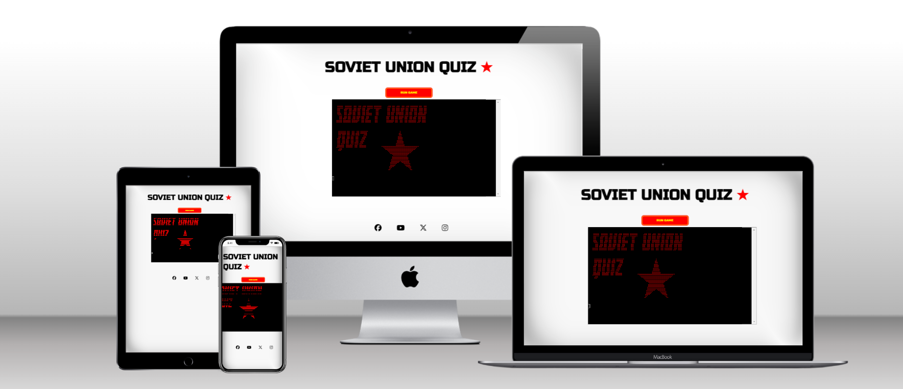

# Soviet Union Quiz

Welcome to Soviet Union Quiz! This quiz game was created for all the people enthusiastic and nostalgic about Soviet Union, for those who are interested to know some of its great achievements, culture and controversies. Churchill defined Russia as "a riddle, wrapped in a mystery, inside an enigma". Perhaps no better quote could define as well the history of USSR - of which Russia is its direct inheriter.
The project is dedicated to Yuri Gagarin, whose travel in space represents the peak of USSR glory. 

The game is a Python command-line terminal quiz, which runs in the Code Institute mock terminal on Heroku.

The link to our Live Website can be found here - [Soviet Union Quiz](https://soviet-union-8544d8a31c4f.herokuapp.com/).

## Index - Table of Contents

- [Planning](#planning)
- [Design](#design)
- [UX](#ux)
    - [Programm Goals](#programm-goals)
    - [User Stories](#user-stories)
- [Features](#features)
    - [Existing Features](#existing-features)
    - [Future Features](#possible-future-features)
- [Data Model](#data-model)
- [Testing](#testing)
    - [Validator Testing](#validator-testing)
    - [Browser Testing](#browser-testing)
    - [Testing User Stories](#testing-user-stories-functionality)
- [Debugging](#debugging)
    - [Fixed bugs](#fixed-bugs)
    - [Unfixed bugs](#unfixed-bugs)
- [Deployment](#deployment)
- [Credits](#credits)
    - [Data](#data)
    - [Code](#code)
    - [Styling](#styling)

## Planning

The project was firstly conceived through the creation of the following diagram. It was created with [lucidchart.com](https://www.lucidchart.com/). 

## Design

### Color scheme

Since this is a simple terminal based application, the design process for the user interface was limited.

Different colors are used to categorize different types of messages displayed to the user:
- Red -> error due to invalid input given by the user to the programme 
- Blue -> hints to help the user to answer each question
- Green -> correct answer given by the user to a quiz question
- Red -> incorrect answer given by the user to a quiz question
- Cyan -> after choosing an answer to a question, the user has the option to get a few more information about the topic, which is highlighted in cyan color

Red color is used as well for the 2 ASCII art images at the start of the quiz, for the leaderboard at the end and for the red star (present in the header of the quiz, in the first text based screen of the programme and in the instructions). The choice of red as the predominant color aims at recalling the color of the flag of Soviet Union. 

### Imagery

- The red star is one of the most famous symbols of USSR - its meaning is explained in one of the questions of the quiz, therefore no spoilers will be done here. Still today in Moscow, there are some state buildings with the red star on top.
FOTO TO UPLOAD
- In the second ASCII ART image there is Yuri Gagarin. By achieving the major milestone to be the first cosmonaut in space for Soviet Union amidst the Space Race, he became an international celebrity and was awarded many medals and titles, including the nation's highest distinction: Hero of the Soviet Union.
FOTO TO UPLOAD
- The favicon is another well known symbol of Soviet Union, which is the hammer and the sieckle. It represents the proletarian solidarity between agricultural and industrial workers. It was first adopted during the Russian Revolution at the end of World War I, the hammer representing workers and the sickle representing the peasants.

### Typography 

- The font chosen for the title "Soviet Union Quiz" is "Russo One". Russo One was chosen because it is a Unicode typeface family that supports languages that use the Cyrillic, Baltic, Turkish, Central Europe, Latin script and its variants. 
FOTO TO UPLOAD
- The font chosen for the first ASCII image is Buran. The font is dedicated to the memory of the Soviet Space Shuttle named Buran - for more information click <a href="https://en.wikipedia.org/wiki/Buran_%28spacecraft%29" target="_blank" rel="noopener" aria-label="Check the Buran page of Wikipedia">here</a>. 
Source of the font is https://www.dafont.com/buran-ussr.font

