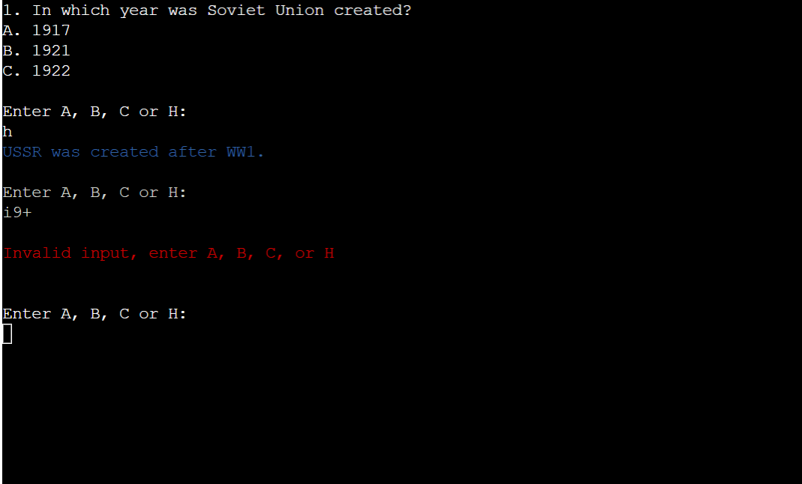
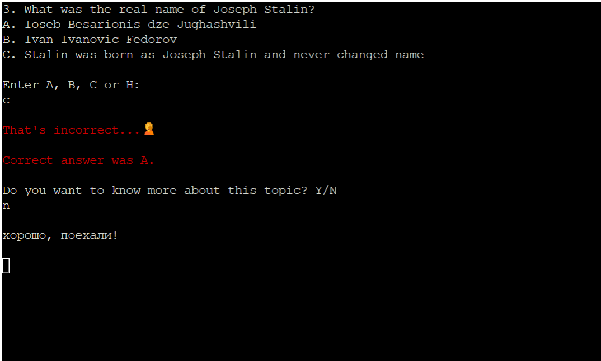

# Soviet Union Quiz

Welcome to Soviet Union Quiz! This quiz game was created for all the people enthusiastic and nostalgic about Soviet Union, for those who are interested to know some of its great achievements, culture and controversies. Churchill defined Russia as "a riddle, wrapped in a mystery, inside an enigma". Perhaps no better quote could define as well the history of USSR - of which Russia is its direct inheriter.
The project is dedicated to Yuri Gagarin, whose travel in space represents the peak of USSR glory. 

The game is a Python command-line terminal quiz, which runs in the Code Institute mock terminal on Heroku.

The link to our Live Website can be found here - [Soviet Union Quiz](https://soviet-union-8544d8a31c4f.herokuapp.com/).

## Index - Table of Contents

- [Planning](#planning)
- [Design](#design)
- [UX](#ux)
    - [Programm Goals](#programm-goals)
    - [User Stories](#user-stories)
- [Features](#features)
    - [Existing Features](#existing-features)
    - [Future Features](#future-features)
- [Testing](#testing)
    - [Validator Testing](#validator-testing)
    - [Browser Testing](#browser-testing)
    - [Testing User Stories](#testing-user-stories-functionality)
- [Unfixed bugs](#unfixed-bugs)
- [Technologies used](#technologies-used)
- [Deployment](#deployment)
- [Credits](#credits)
- [Acknowledgements](#acknowledgements)

## Planning

The project was firstly conceived through the creation of the below diagram thanks to [lucidchart.com](https://www.lucidchart.com/). The diagram helped me to visualise the steps required for the game and which functions might be required to implement them.

## Design

### Color scheme

Since this is a simple terminal based application, the design process for the user interface was limited.

Different colors are used to categorize different types of messages displayed to the user:
- Red -> error due to invalid input given by the user to the programm 
- Blue -> hints to help the user to answer each question
- Green -> correct answer given by the user to a quiz question
- Red -> incorrect answer given by the user to a quiz question
- Cyan -> after choosing an answer to a question, the user has the option to get a few more information about the topic, which is highlighted in cyan color

Red color is used as well for the 2 ASCII art images at the start of the quiz, for the leaderboard at the end and for the red star (present in the header of the quiz, in the first text based screen of the programm and in the instructions). The choice of red as the predominant color aims at recalling the color of the flag of Soviet Union. 

### Imagery

- The red star is one of the most famous symbols of USSR - its meaning is explained in one of the questions of the quiz, therefore no spoilers will be done here. Still today in Moscow, there are some state buildings with the red star on top.

Red Star - Quiz Title

Red Star on top of the Kremlin in Moscow

- In the second ASCII ART image there is Yuri Gagarin. By achieving the major milestone to be the first cosmonaut in space for Soviet Union amidst the Space Race, he became an international celebrity and was awarded many medals and titles, including the nation's highest distinction: Hero of the Soviet Union.

- The favicon is another well known symbol of Soviet Union, which is the hammer and the sieckle. It represents the proletarian solidarity between agricultural and industrial workers. It was first adopted during the Russian Revolution at the end of World War I, the hammer representing workers and the sickle representing the peasants.

### Typography 

- The font chosen for the title "Soviet Union Quiz" is "Russo One". Russo One was chosen because it is a Unicode typeface family that supports languages that use the Cyrillic, Baltic, Turkish, Central Europe, Latin script and its variants. 

- The font chosen for the first ASCII image is Buran. The font is dedicated to the memory of the Soviet Space Shuttle named Buran - for more information click <a href="https://en.wikipedia.org/wiki/Buran_%28spacecraft%29" target="_blank" rel="noopener" aria-label="Check the Buran page of Wikipedia">here</a>. 
Source of the font is https://www.dafont.com/buran-ussr.font

## UX

### Programm Goals

The programm aims at providing the user with a simple and intuive multiple choice quiz game, which can be repeated as many times as the user wants. 

### User Stories

#### As a user I want to:

- have an intro image to get into the atmosphere of Soviet Union 
- be able to read a short introduction about the quiz when it first loads 
- be able to enter a username 
- be alerted by the programm if no username was entered from my side
- be able to have the choice to read or not the instructions before playing the game 
- have the choice to get hints before answering questions of which I don't know the answer
- have the option to choose straight away the answer among A) B) or C) option, if I don't want to get any hint
- be alerted by the programm if I have not entered any of the valid option after a question, which should be A), B), C) or H)
- be alerted by the programm if I have answered correctly
- be alerted by the programm if I have NOT answered correctly and to know which answer was the correct one
- have the option to get further information about the question topic after replying to it or to skip that
- have time to read the additional information and choose when to proceed with the next question
- get an error message if the input to the just mentioned option was incorrect
- get a total score of my points at the end of the game
- get displayed a leaderboard at the end of the game to see how my score ranks compared to other players
- get the option at end of the game to play again
- play again without the need to read again the instructions
- repeat the game as many times as I wish
- have the choice to quit the game after finishing it
- get a good-bye message when quitting the game

#### As a site administrator I want to ####
- be able to make modifications to the game (see [future features](#future-features))
- offer the user with a short, entertaining and informative game

## Features

### Existing Features

#### Introduction ASCII Images
2 ASCII images are used at the very start of the game:

1. Intro Image 

2. Gagarin Image 

#### Introduction to the game and requirement to enter username

In the first text screen, there is a short welcome message and introduction to the game. The user is then immediately asked to enter a username. 

When the player will have submitted a username, he will get the below text in Russian. 

привет, товарищ means "Hello, comrade". In the early years of Soviet power, the Bolsheviks used товарищ ( pronounced "Tovarisch") when addressing to people assumed sympathetic to the revolution and to the Soviet state, such as members of the Communist party and people from the "working masses". By the mid-1920s, the form of address Tovarisch became so commonplace in the Soviet Union that it was used indiscriminately in essentially the same way as terms like "Mister" and "Sir" are employed in English. That use persisted until the dissolution of the Soviet Union.

The username entered by the user has to consist of numbers or letters. They can't enter a blank space. If they don't enter valid data, an error message will appear asking to submit a valid username.

#### Game instructions
After the username is submitted, the user will be given the option to read or not the game instructions:
- If Y is entered, the instructions will appear and after giving the time to go through all of them, the programm will automatically load the first quiz question. 

- If N is entered, the instructions will not be displayed and the programm will bring the user directly to the first question.

- If the user enters a letter, symbol or number different than Y/N, the programm will display an error message and prompt the user to enter the correct input. 

#### Quiz questions
For each question the user will be given the option to select among A), B), C) or H):
- H stands for Hint: by entering H the user will receive a hint that will help him to answer to the question. After the Hint is given, the player will be asked again to select among A), B), C) or H). If H is selected again, the hint will re-appear.

- A), B), C) are the answers at disposal of the user. If the choice is correct, the player will receive the following message in green. 

If the choice is incorrect, the player will get the below message in red, that will confirm as well which was the correct answer. 

If the user will enter a letter, number or symbol different than A), B), C) or H), an error message will appear and the player will be asked to enter again a correct input. 

#### Additional information about each question's topic
After an answer to each question is given, the player will have the option to get or not additional information about the question's topic:
- If Y is selected, the additional information about Soviet history or curiosities will appear. 

- If N is selected, the programm will display again "хорошо, поехали" and go ahead with the next question. 

The phrase in Russian "хорошо, поехали" means "Ok, let's go". "поехали" is linked to Yuri Gagarin, who said that at the start of the space trip, so you can find a lot of images of Gagarin with “Поехали!” in the internet.

Example of image of Gagarin with “Поехали!”

- If the user will enter a letter, number or symbol different than Y or N, an error message will appear and the player will be asked to enter again a correct input. 

#### Final score and leaderboard
When all the 15 questions of the Quiz are answered, the player will get first a message with its score and then her/his score will be displayed on the leaderboard (if the performance is among the best 10 players), which will pop up immediately after. As it is mentioned in the instructions, 10 points are given for a correct answer and 0 for an incorrect one. 

Final Score

Leaderboard with Final Score

The leaderboard was created using Google Sheets. The spreadsheet is accessed by the game through the Google Drive and Google Sheets APIs on the Google Cloud Platform. Google Sheets is used as well to retrieve the questions, the hints and the answer choices displayed in the quiz.

#### Repeat game option
After the leaderboard has appeared, the user will be given the option to choose if to restart or not the game:
- If the player enters Y, the game restarts. This time the instructions will be not displayed and the user will start the game directly from the 1st question. Before the new game loads, the phrase in Russian "хорошо, поиграем еще!" will be displayed. It means, "Ok, let's play again!".

- If the player enters N, the game finishes and the following good-bye message will appear.

- If the user will enter a letter, number or symbol different than Y or N, an error message will appear and the player will be asked to enter again a correct input. 

#### Text printing

As you may see by playing the game, the text is printed at a "human" typing speed.

### Future Features 

#### Add images/videos to each question's topic

As above mentioned, when a question in the quiz is answered, the user has the option to read additional information about the question's topic. It would be great to add to these information as well images or videos related to them. 

#### Randomize the questions

For future developments of the programm, we would like to randomize the questions answers, so that the quiz would become more challenging for the user that want to repeat it. 

For instance the answers sections of the second question ("How many countries were part of Soviet Union?") is structured as follows:
A) 17
B) 15
C) 13

With the randomization, we could have the following options when the quiz would be running one or multiple times in a row: A) 15, B)13, C)17 
or 
A) 13, B) 17, C) 15

#### Different levels of difficulty

It would be nice to add different levels of difficulty to choose from at the start of the game. Levels of difficulty would be divided accordingly: Beginner, Intermediate, Pro. The more difficult the level, the higher the number of questions. For instance, 15 questions for Beginner, 20 for Intermediate and 30 for Pro.

#### Music toggle

It would be nice to add a music toggle with the Anthem of Soviet Union or other famous Soviet songs, that the player could decide to switch on/off. This would allow to recreate the atmosphere of the past glory of USSR.

#### Background image

Adding a background image around the terminal of the game, such as a map of the Soviet Union. 

#### Congratulation message for highest score

Adding a personalizes congratulation message if the user gets the highest possible score. 

## Testing

### Validator Testing

#### Python Validator 

The programm was checked with CI Python Linter Validator - https://pep8ci.herokuapp.com/. In Python Validator there is just a small issue related to lines. The line of code was longer than 80 characters, but I was not able to shorten it because it contains as well the code to generate the headers of the leaderboard. Therefore I decide to split the line into two.

#### HTML Validator

I added a few modifications to the HTML file to give a better design to the website. Modifications include:
- header
- button
- footer

After adding the above, I checked the HTML validator. No errors were found as per the below screenshot. 

#### CSS Validator 

I added as well a few modifications to the CSS template to add some style to the HTML page. After that, I checked the CSS validator. No error were found except the warnings below. The first is is due to the imported Google fonts. The second and third should be related to the CSS template provided for the project. 

#### Lighthouse Testing

As SEO was not an objective of this particular project, I chose to be content with a rating that is slightly below 90. 

### Browser Testing

The Website was tested on Google Chrome, Microsoft Edge, Firefox and Safari. It works very well and with no issues on Google Chrome and Microsoft Edge. 

On Firefox the programm works pretty well, but emojis are not displayed fully. 

Red star emoji - Firefox

Incorrect answer emoji - Firefox

On Safari the programm does not allow to input the username, therefore it is not possible to continue with the rest of the game. 

Safari bug 

### Testing User Stories (Functionality)

| Expectation (As a user, I want to...)  | Result (As a user, I...)    |
| :---------------------------------: | :------------------------------:|
| have an intro image to get into the atmosphere of Soviet Union | have a beautiful intro image with Yuri Gagarin in space suit |
| be able to read a short introduction about the quiz when it first loads | have a short coincise introduction at the start of the game |
| be able to enter a username | can enter a username |
| be alerted by the programm if no username was entered from my side | get an error message if I didn't enter a username |
| be able to have the choice to read or not the instructions before playing the game | can choose to read or to skip the instructions | 
| have the choice to get hints before answering questions of which I don't know the answer | have the option to get hints for each question |
| have the option to choose straight away the answer among A) B) or C) option, if I don't want to get any hint | can reply to each question without the need to get a hint |
| be alerted by the programm if I have not entered any of the valid option after a question, which should be A), B), C) or H) | get an error message when my input is invalid |
| be alerted by the programm if I have answered correctly | get a congratulation message when I answer correctly |
| be alerted by the programm if I have NOT answered correctly and to know which answer was the correct one | get informed if my answer was incorrect and which option was the correct one  |
| have the option to get further information about the question topic after replying to it or to skip that | have the opportunity to get more information about each topic question and to deepen my Soviet knowledge |
| have time to read the additional information and choose when to proceed with the next question | have all the time I need to read the additional facts about Soviet Union and can choose when to go to the next question |
| get a total score of my points at the end of the game | get a score of my points at the end of the quiz |
| get a leaderboard at the end of the game to see how my score ranks compared to other players | get a leaderboard at the end of the quiz where I can see how my performance ranks among all previous players |
| get the option at end of the game to play again | have the option to play again at the end of the quiz |
| play again without the need to read again the instructions | don't get the option to read again the instructions when I decide to repeat the game |
| repeat the game as many times as I wish | can repeat the game endlessly |
| have the choice to quit the game after finishing it | can quit the game after replying to all the questions |
| get a good-bye message when quitting the game | get a good-bye message when I choose to quit the game |

### Fixed bugs 

#### Leaderboard not printing correctly the result of the restart game

When I decided to restart the game, everything worked fine except the printing of the second score in the leaderboard (if the score would be among the 10 best). The game should have printed the same username entered before starting the game the 1st time (there is no option to change username for the restart game) and update the table with the new score of the 2nd game if among the 10 best. This should have not overrided the score of the 1st game, but be simply listed in the table as same username + new score on top of the previous score (if both among the 10 best scores). The bug was that at the end of the restart game the table was updated with a doubled entry of the score of the first game. 

To solve the issue I created a main function at the end of the file to wrap up the functions related to the leaderboard and points counting and pasted the function in the restart_game function.

### Unfixed bugs

#### Username input in Safari not working 
As mentioned in the browser testing, the programm on Safari does not allow to input the username, therefore it is not possible to continue with the rest of the game. 

####

## Technologies used

### Languages
- Python
- HTML
- CSS

### Python Libraries:
- [gspread](https://pypi.org/project/gspread/): to allow communication with Google Sheets
- [google.oauth2.service_account](https://google-auth.readthedocs.io/en/stable/index.html):  used to validate credentials and grant access to google service accounts
- [colorama](https://pypi.org/project/colorama/) - for adding colour to terminal text
- [simple_colors](https://pypi.org/project/simple-colors/) - for adding colour to terminal text
- [tabulate](https://pypi.org/project/tabulate/) - for printing the leaderboard
- [os](https://docs.python.org/3/library/os.html?highlight=os#module-os) - to clear the terminal when beginning a new game
- [time] - this library is installed by default in Python, therefore I did not need to download it.
- [art](https://pypi.org/project/art/) - for creating ASCII art images
- [sys] (https://pypi.org/project/os-sys/)

### Programs used

- [Chrome Dev Tools](https://developer.chrome.com/docs/devtools/) - for testing responsivness, development of the website and lighthouse testing
- [Google Fonts](https://fonts.google.com/) - for the fonts of the website
- [Lucidchart](https://lucidchart.com/) - to create the diagram for conceiving the project
- [Picsart](https://tools.picsart.com/) - for the emojis of the red star and of the incorrect answer
- [TwichQuotes](https://www.twitchquotes.com/ascii-art-generator) - to generate the 2 ASCII Art Images
- [ImageOnline](https://crop-circle.imageonline.co/) - to crop as a circle the favicon logo
- [Imgur](https://imgur.com/) - to host the favicon logo on a website (otherwise it would have not been possible to display the favicon)

## Deployment

The site was deployed via [Heroku](https://dashboard.heroku.com/apps), and the live link can be found here: [Soviet Union Quiz](https://soviet-union-8544d8a31c4f.herokuapp.com/)

Before deploying to Heroku pip3 freeze > requirements.txt was used to add all the dependencies required to the requirements.txt file. This is required for the game to run on Heroku.

The following steps were then taken:
1. Log in to [Heroku](https://dashboard.heroku.com/apps) or create an account.
2. On the main page click the button labelled New in the top right corner and from the drop-down menu select "Create New App".
3. Enter a unique and meaningful app name.
4. Next select your region.
5. Click on the Create App button.
6. Click on the Settings Tab and scroll down to Config Vars.
7. Click Reveal Config Vars and enter port into the Key box and 8000 into the Value box and click the Add button.
8. Input CREDS and the content of your Google Sheet API creds file as another config var and click add.
9. In the next Key box enter OXFORD_API_APP_ID and add your unique ID to the value box. 
10. In the next Key box enter OXFORD_API_APP_KEY and add your unique key to the value box. 
11. Next, scroll down to the Buildpack section click Add Buildpack select Python and click Save Changes
12. Repeat step 11 to add node.js. Note: The Buildpacks must be in the correct order. If not click and drag them to move into the correct order.
13. Scroll to the top of the page and choose the Deploy tab.
14. Select Github as the deployment method.
15. Confirm you want to connect to GitHub.
16. Search for the repository name and click the connect button.
17. Scroll to the bottom of the deploy page and either click Enable Automatic Deploys for automatic deploys or Deploy Branch to deploy manually. Manually deployed branches will need re-deploying each time the repo is updated.
18. Click View to view the deployed site.

The site is now live and operational.

## Credits

### Media
- [Pinterest](https://www.pinterest.it/) - for the photo of Yuri Gagarin and the logo of the favicon
- [Wikipedia](https://www.wikipedia.org/) - for all the facts and knowledge about Soviet Union in the quiz

### Code used
- This project was studied in-depth as model for the Quiz game and the theme of space travel - [space-quiz of Boiann](https://github.com/Boiann/space-quiz/tree/main)
- Inspiration for the Quiz game - [3rd_Project_Quiz_Game of mikyrenato](https://github.com/mikyrenato/3rd_Project_Quiz_Game)
- To understand how to install the favicon - [harry-potter-adventure-game of AlexaH88](https://github.com/AlexaH88/harry-potter-adventure-game/tree/main)
- Inspiration for the readme - [CI-PP3_hangman of Kathrin-ddggxh](https://github.com/Kathrin-ddggxh/CI-PP3_hangman/tree/main?tab=readme-ov-file#features)
- Inspiration for the diagram - [word-Py of AliOKeeffe](https://github.com/AliOKeeffe/word-Py/tree/main)
- Code in-depth study - [Stack overflow](https://stackoverflow.com/)
- Additional details about the sources of the code used are mentioned as comments in the run.py file

## Acknowledgements

My mentor, for his great support and for being a polar-star during my project. 

My wife (who is Russian), for the years spent with her allowed me to fall in love with the Slavic culture and world.

Kay of Code Institute and the Slack Community

